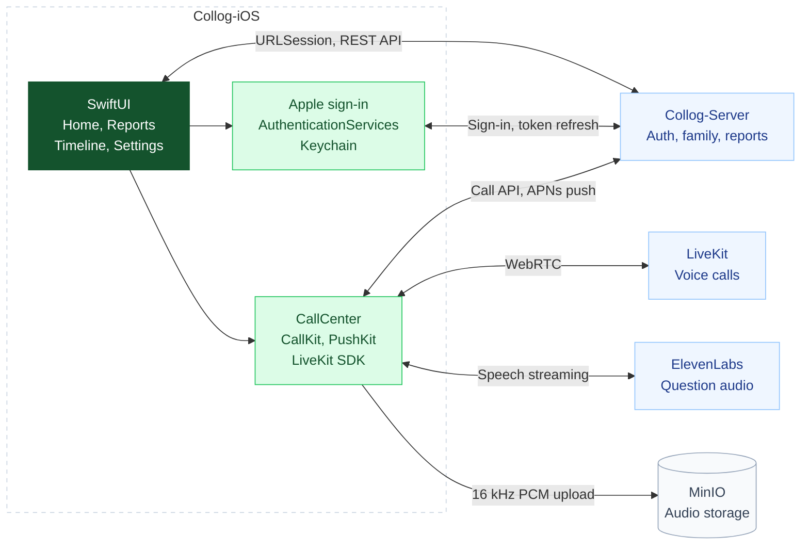

### 콜록 iOS

https://testflight.apple.com/join/6DEKfQMw

> 멋쟁이사자처럼대학 14기 중앙해커톤 AAC 트랙 128팀 중 **2위**  
> 멋쟁이사자처럼대학 14기 중앙해커톤 317팀 중 **장려상**

 

© 2026 Team Raichu of LIKELION SeoulTech. All rights reserved.

